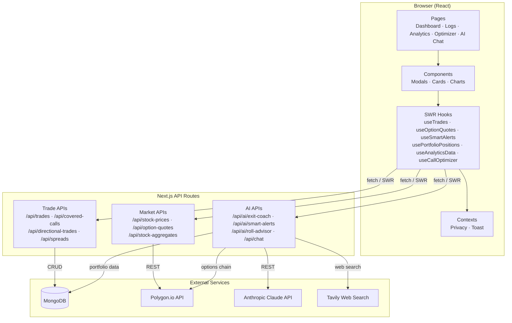
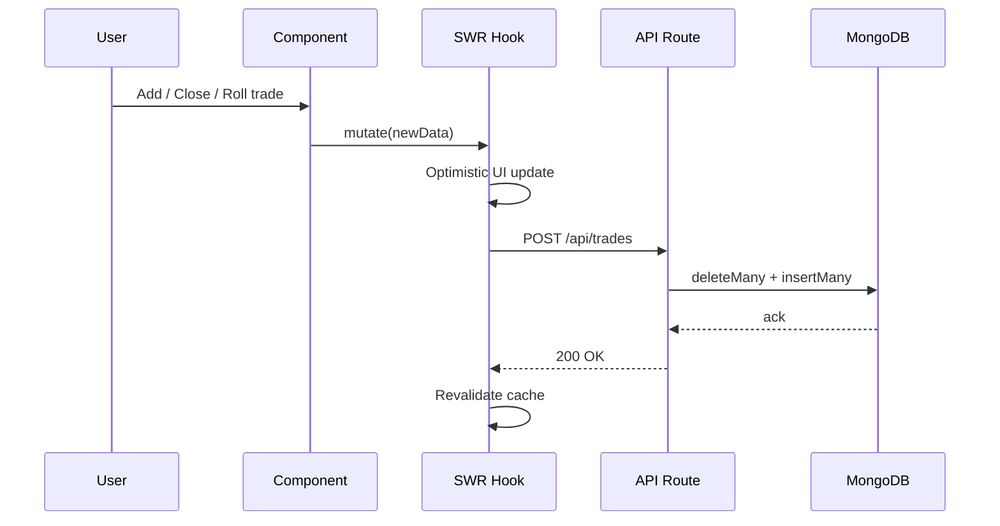
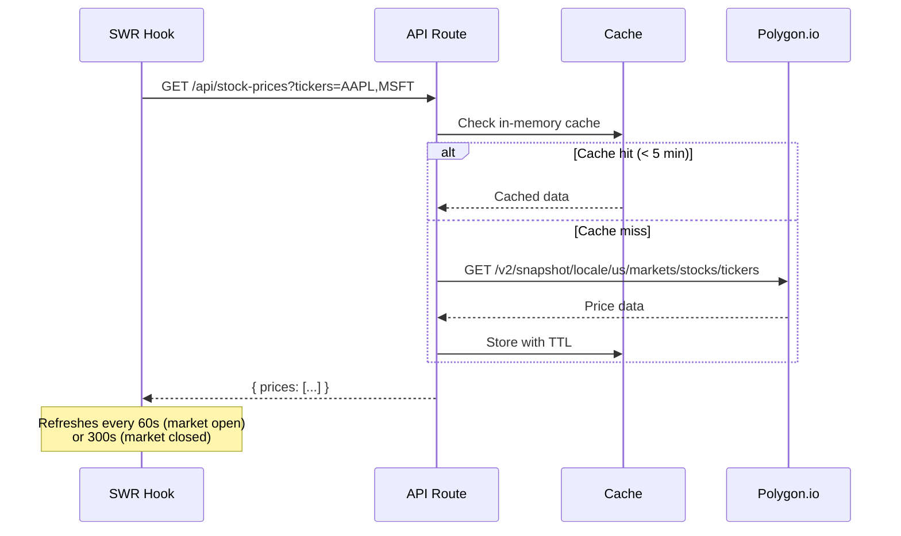
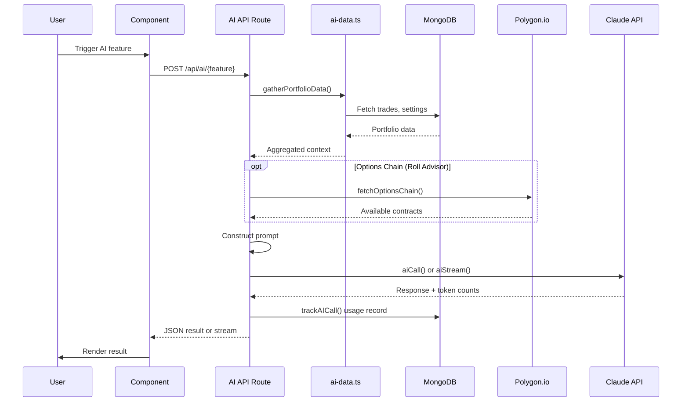
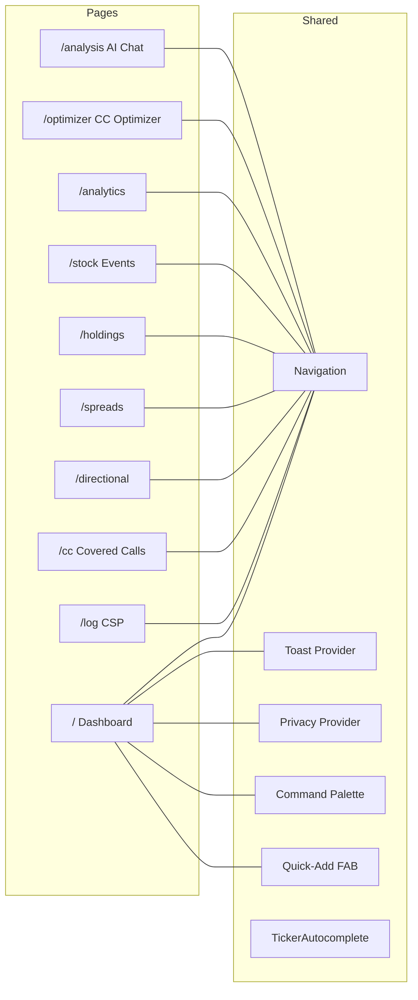
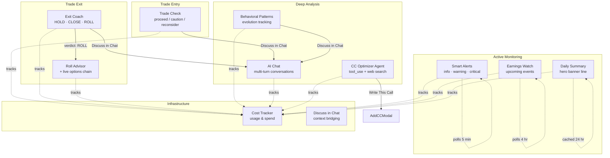
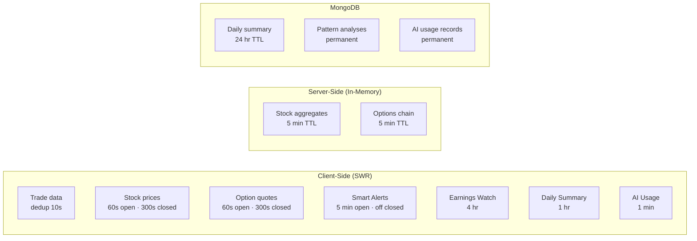

# Architecture

Visual guide to the OptiTrade Dashboard architecture.

---

## System Overview

---

## Data Flow

### Trade Operations

### Market Data Pipeline

### AI Feature Pipeline

---

## Page Architecture

---

## Database Schema

```mermaid
erDiagram
    TRADES {
        string id PK
        string ticker
        number strike
        number contracts
        string expiration
        string entryDate
        number premiumCollected
        number collateral
        string status
        string exitReason
    }

    COVERED_CALLS {
        string id PK
        string ticker
        number strike
        number contracts
        number sharesHeld
        number costBasis
        number premiumCollected
        string status
        string exitReason
    }

    DIRECTIONAL_TRADES {
        string id PK
        string ticker
        string optionType
        number strike
        number entryPrice
        number costAtOpen
        string status
        string exitReason
    }

    SPREADS {
        string id PK
        string ticker
        string spreadType
        number longStrike
        number shortStrike
        number netDebit
        number maxProfit
        number maxLoss
        string status
    }

    HOLDINGS {
        string id PK
        string ticker
        number shares
        number costBasisPerShare
        string acquiredDate
    }

    STOCK_EVENTS {
        string id PK
        string ticker
        number shares
        number costBasis
        number salePrice
        number realizedPL
        boolean isTaxLossHarvest
    }

    AI_USAGE {
        string timestamp
        string feature
        string model
        number inputTokens
        number outputTokens
        number costUsd
    }

    PATTERN_ANALYSES {
        string id PK
        string timestamp
        json patterns
        number tradeCount
        number totalPL
        number winRate
    }

    DAILY_SUMMARY {
        string id PK
        string summary
        string generatedAt
    }

    CONVERSATIONS {
        string id PK
        string title
        json messages
        string createdAt
    }

    AGENT_TRACES {
        string id PK
        string createdAt
        array tickers
        string mode
        json steps
        number totalDurationMs
        number totalInputTokens
        number totalOutputTokens
        number costUsd
        json result
    }

    ACCOUNT_SETTINGS {
        number accountValue
        number maxHeatPercent
        number alertDTEWarning
        number alertDTECritical
        number alertHeatThreshold
    }
```

---

## AI Features Map

---

## Caching Strategy

---

## Component Hierarchy (Dashboard)

```mermaid
graph TD
    Page["page.tsx (Dashboard)"]
    Page --> Portfolio["usePortfolioPositions<br/>(master data hook)"]

    Page --> Nav["Navigation + AICostIndicator"]
    Page --> Alert["ExpirationAlertBanner"]
    Page --> Smart["SmartAlertsBadge"]
    Page --> Earn["EarningsWatchCard"]
    Page --> Hero["Hero Banner"]
    Hero --> Summary["DailySummaryLine"]
    Page --> Pulse["Strategy Pulse Cards"]
    Page --> Greeks["PortfolioGreeksCard"]
    Page --> Theta["ThetaDashboardCard"]
    Page --> Pressure["PressureCard"]
    Page --> Timeline["PositionsTimeline"]
    Timeline --> Detail["PositionDetailModal"]
    Detail --> Coach["AI Exit Coach (tab 4)"]
    Page --> Capital["CapitalAllocationCard"]
    Page --> Recent["Recent Activity"]
    Page --> FAB["QuickAddFAB"]
    Page --> CmdK["CommandPalette"]

    FAB --> AddCSP["AddTradeModal"]
    FAB --> AddCC["AddCCModal"]
    FAB --> AddDir["AddDirectionalModal"]
    FAB --> AddSprd["AddSpreadModal"]

    AddCSP --> TradeCheck["AITradeCheck"]
    AddCC --> TradeCheck
    AddDir --> TradeCheck
    AddSprd --> TradeCheck
```

---

## Request Flow Summary

| Layer | Technology | Role |
|-------|-----------|------|
| **UI** | React + Tailwind | Dark-themed components, glass-card styling |
| **State** | SWR + React Context | Caching, optimistic updates, privacy/toast |
| **API** | Next.js App Router | Server-side routes, no auth layer |
| **Data** | MongoDB | Document store for all trade and AI data |
| **Market** | Polygon.io | Stock prices, option quotes, aggregates, events |
| **AI** | Anthropic Claude | Haiku 4.5 (fast calls), Sonnet 4.6 (deep analysis + CC Optimizer agent) |
| **Search** | Tavily | Web search for AI agent (analyst targets, earnings, news) |
